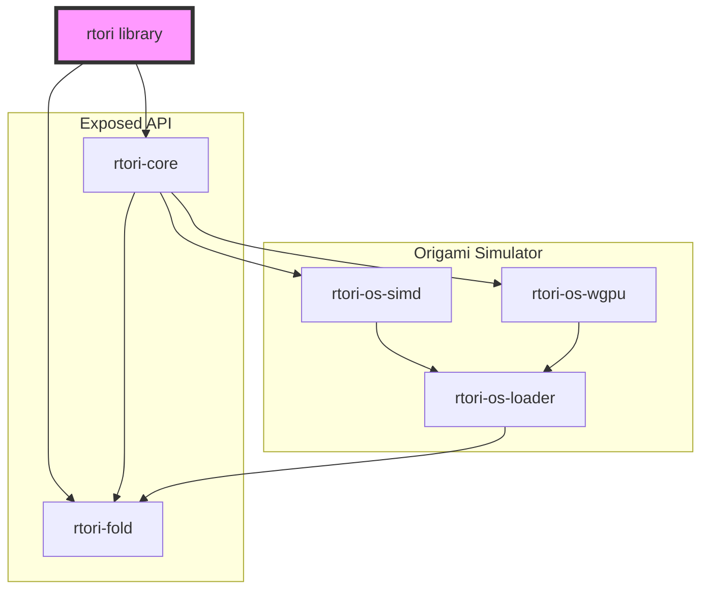

# RTOri: Real Time Origami Toolkit

Making real-time origami pattern **manipulation** and fold **simulation** easy. Coming to you from the [orilab](https://orilab.art/).

On a high-level view, this project provides plugins, apps and bindings to manipulate and simulate origamis on a variety of platforms  and with a diversity of use cases. 

## Goals

- open source, and open to contributions from the community
- provide software components to manipulate and simulate origamis
- modular, able to integrate new manipulations and new origami solvers & simulators seemlessly
- easy to integrate as plugins for existing apps, as well as in custom apps
- usable from multiple languages (C++, .NET, python, js, ...), crossplatform (Windows, macOS, Linux, Web, ...), and cross-architecture (x86_64, arm64, wasm)

## Simulation Models

- Origami Simulator by Amanda Ghaessi
    - CPU (SIMD accelerated) 🚧
    - GPU 🚧
- ??

## Apps, plugins, bindings

### RTOri as Plugins

This project has been designed from the ground up to provide origami manipulation and simulation to existing apps as plugins, allowing designers, scientists, students, makers and artists around the world to access origamis in their existing workflows.

We thought about the following targets, please open an issue to express interest:

| App Name          | Manipulation | Simulation | Bindings |
|:-----------------:|:------------:|:----------:|:--------:|
| [Touchdesigner](https://derivative.ca/UserGuide/TouchDesigner) | ❌ | 🚧 | C++ |
| Blender           | ❌ | ❌ | py |
| Rhino             | ❌ | ❌ | .NET |
| ↪ Grasshopper     | ❌ | ❌ | .NET |
| Unity             | ❌ | ❌ | .NET |
| Unreal            | ❌ | ❌ | C++  |
| Godot             | ❌ | ❌ | rust/C++ ? |

### RTOri as Apps

- `rtori-cli` provides two operation kind:
    - `convert` to convert into and from the fold format
    - `simulate` to run simulations

### RTOri as Bindings

| Ecosystem   | State |
|:-----------:|:--:|
| C++         | 🚧 |
| .NET        | ❌ |
| py          | ❌ | 
| Web (wasm)  | ❌ |

## Software architecture
(mermaid graph)

## Target Architectures

Potential support: (In LLVM/Rust triplet)

- `thumbv8m.main-none-eavi`: for Raspberry Pi RP2350 (rtori-core only)
- `thumbv6m-none-eabi`: for Raspberry Pi 2040 (rtori-core only)
- `x86_64-pc-windows-msvc`: for Windows on x86-64
- `i686-pc-windows-msvc`: for Windows on x86-32
- `aarch64-pc-windows-msvc`: for Windows on ARM
- `x86_64-apple-darwin`: for MacOs on Intel
- `aarch64-apple-darwin`: for MacOS on Apple Silicon
- `x86_64-unknown-linux-gnu`: for Linux on x86-64 (gnu)
- `x86_64-unknown-linux-musl`: for Linux on x86-64 (musl)
- `arm-unknown-linux-gnueabihf`: for Linux on armv6 (rpi 1)
- `armv7-unknown-linux-gnueabihf`: for Linux on rpi 2 rev 1.0
- `aarch64-unknown-linux-gnu`: for Linux on aarch64 (rpi 2 and later)
- `aarch64-unknown-linux-musl`: for Linux on aarch64 (rpi 2 and later) (musl)
- `riscv32imac-unknown-none-elf`: for rp2350 (riscv cores)
- `wasm32-unknown-unknown`: for web/wasm
- `arm64ec-pc-windows-msvc`: for windows on arm in "Emulation-Compatible" contexts